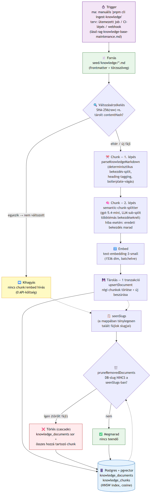

# Plant Care Knowledge Base — karbantartási architektúra-spec

> Ez a dokumentum azt írja le, hogyan tartjuk karban a `seed/knowledge/`-ből épített RAG-tudásbázist (pgvector-alapú `knowledge_documents`/`knowledge_chunks` tábla) — nem a RAG-pipeline működését (l. `docs/homework_3/rag-chat-pipeline.md` és `docs/architektura.md`), hanem az élettartam-menedzsmentjét. Ez terv/architektúra-dokumentáció — a triggerelési rész (ütemezett/CI-alapú újraindexelés) egyelőre **nincs leimplementálva**, a jelenlegi rendszerben az `ingest-knowledge` futtatása manuális.

## Új forrás-cikk hozzáadása

1. Helyezz el egy `.md` fájlt a `seed/knowledge/` mappában, a meglévő konvenció szerint:
   - Fájlnév: `<forrás-slug>__<cikk-slug>.md` (pl. `ask-the-sill__how-to-care-for-a-snake-plant.md`) — ez lesz a `KnowledgeDocument.slug`, tehát egyedinek kell lennie.
   - YAML frontmatter kötelező mezői: `title`, `source` (eredeti URL, ez jelenik meg forrás-hivatkozásként a válaszokban), `category`.
   - A törzsben H2/H3/H4 alcímek ajánlottak — a chunkolás ezeket használja fel metaadatként (`heading`), és ezek mentén tud jobban tájékozódni a szemantikus finomítás is.
2. Futtasd: `pnpm cli ingest-knowledge`.
3. Ellenőrizd a kimenetet — hány chunk keletkezett az új dokumentumhoz, nincs-e hibaüzenet.

## Trigger — mikor/mi indítja az újraindexelést

**Jelenlegi állapot**: kizárólag **manuális** — valaki lefuttatja a `pnpm cli ingest-knowledge` parancsot. Ez a legegyszerűbb, legátláthatóbb megoldás egy ilyen méretű (202 dokumentum), ritkán változó tudásbázisnál, és semmilyen extra infrastruktúrát nem igényel.

**Ez a szekció NEM implementációt ír le, hanem tervet** arra, hogyan skálázódna ez, ha a forrás gyakrabban változna vagy a manuális lépés elfelejthetővé válna:

1. **Ütemezett job (cron)** — a legegyszerűbb automatizálás: egy napi/óránkénti cron-feladat lefuttatja az `ingest-knowledge` parancsot. Mivel a `contentHash`-alapú idempotencia miatt a változatlan fájlok kihagyásra kerülnek (l. lent), egy felesleges, gyakori futtatás **nem drága** — ez a legolcsóbb módja annak, hogy sose kelljen kézzel emlékezni a futtatásra. Hátrány: a változás és az újraindexelés között akár egy teljes ütemezési periódus is eltelhet (pl. napi cronnál 24 óra).
2. **CI/CD-lépés a `seed/knowledge/` mappát érintő PR merge-nél** — ha a forrás-cikkek maguk is verziókövetettek (jelenleg így van: a `seed/knowledge/*.md` a repo része), egy GitHub Actions workflow, ami a `seed/knowledge/**` útvonalra figyel, és `main`-re mergelés után lefuttatja az ingestiont éles adatbázison. Előnye: a forrás és a vektorizált állapot sosem szakad el egymástól hosszabb időre, és a változás átlátható (code review-n megy át, mint bármilyen más kódváltozás).
3. **Webhook / esemény-alapú trigger** — ha a forrás nem a repóban élne, hanem egy külső CMS-ben (pl. a cikkeket tényleg a The Sill/NYBG oldaláról szereznénk élőben, nem egyszeri scrape-eléssel), egy webhook (a CMS "publikálva" eseményére) hívhatná az ingestion API-t egy adott slug-ra — ez lenne a leggyorsabb reakcióidejű megoldás, de a legtöbb extra mozgó alkatrésszel (webhook-fogadó végpont, hitelesítés, retry-logika hálózati hiba esetén).

**Melyiket választanánk**: jelen méretnél és forrás-jellegnél (kis számú, kézzel kurátort cikk, repóban verziókövetve) a **2. opció (CI-lépés PR-mergenél)** lenne az első lépés — nem igényel új infrastruktúrát (a repo már CI-ban fut), és a forrás-verziókövetés + az ingestion összekapcsolása révén a "melyik commit vitte be ezt a tudásbázis-változást" kérdés is automatikusan megválaszolható marad. Egy `1.` opcióbeli napi cron ráadásul jó kiegészítő védőháló lenne akkor is, ha a CI-lépés valamiért kimaradna (pl. valaki force-push-olt egy hibás állapotot) — a két megoldás nem kizárja, hanem kiegészíti egymást.

## Idempotencia — miért nem drága egy ismételt futtatás

Minden dokumentumhoz eltároljuk a nyers `.md` fájl SHA-256 hash-ét (`KnowledgeDocument.contentHash`). Az `ingest-knowledge` parancs minden fájlnál előbb ezt hasonlítja össze — ha nem változott, **kihagyja** a chunkolást/szemantikus elemzést/embeddelést (ezek a drága, API-hívást igénylő lépések). Ez azt jelenti, hogy a teljes `seed/knowledge/` mappán bármikor lefuttatható a parancs — csak a ténylegesen módosult fájlak kerülnek újrafeldolgozásra.

## Mi történik egy módosított fájllal

Ha egy már betöltött `.md` fájl tartalma megváltozik (más a hash), az adott dokumentum **összes régi chunkja törlődik**, majd a teljes fájl újra chunkolódik/embeddelődik — egyetlen DB-tranzakcióban (lásd `packages/core/src/rag/knowledge-repository.ts` — `upsertDocument`). Ez azért fontos, mert egy chunk-számot csökkentő szerkesztésnél (pl. egy bekezdés törlése) különben "árva", elavult chunkok maradnának a régi tartalommal.

## Mi történik egy törölt fájllal

Ha egy `.md` fájl eltűnik a `seed/knowledge/`-ből, az `ingest-knowledge` parancs a futás végén összeveti a mappában ténylegesen talált slugokat a DB-ben lévőkkel, és törli azokat a `KnowledgeDocument` sorokat, amikhez már nincs forrásfájl (`pruneRemovedDocuments`) — ez cascade-eli a hozzájuk tartozó chunkokat is. Nincs manuális takarítás.

## Index-karbantartás, ahogy nő az adat

A `knowledge_chunks.embedding` oszlopon HNSW-index van (`vector_cosine_ops`) — ez growth-tűrő (nem igényel újratanítást, mint az ivfflat), de nagy adatmennyiségnél (több tízezer chunk) érdemes figyelni:
- `EXPLAIN ANALYZE` a `searchSimilarChunks` lekérdezésen, hogy tényleg az indexet használja-e.
- Ha a chunk-szám drasztikusan nő, az `m`/`ef_construction` HNSW-paraméterek finomhangolása megfontolandó (jelenleg a pgvector alapértékeivel fut — lásd a migrációt: `packages/db/prisma/migrations/20260722190146_add_knowledge_base/migration.sql`).

## Hibakezelés, résztelegesség

- **Per-dokumentum tranzakció**: ha az `upsertDocument` egy adott fájlnál hibázik (pl. DB-kapcsolat megszakad), a korábban már sikeresen feldolgozott fájlok változása megmarad — nem kell az egész ingestion-futást elölről kezdeni.
- **Szemantikus chunk-splitter fail-safe**: ha a helper-modell (gpt-5.4-mini) hívása egy bekezdésnél hibázik (időtúllépés, rate limit), a bekezdés simán egy chunkként megy tovább finomítás nélkül — ez sosem rosszabb, mint a korábbi (bekezdés-szintű) chunkolás, csak kevésbé specifikus.
- Ha egy fájl feldolgozása hibával áll le, a parancs kilép hibakóddal, de a addig feldolgozott fájlok DB-állapota érvényben marad — a hibás fájl javítása után a parancs újrafuttatható, a már sikeres fájlok a hash-egyezés miatt automatikusan kimaradnak.
- **NUL-byte védelem**: Postgres a `text` oszlopokban nem fogad el `NUL` byte-ot ("invalid byte sequence for encoding UTF8: 0x00") — ez élesben elő is fordult (egy scrapelt cikk feldolgozása közben), és a teljes ingestion-folyamatot megállította. Az `upsertDocument` (`knowledge-repository.ts`) mostantól minden beírt szöveges mezőből kiszűri ezt, mielőtt a DB-be írná.
- **Üres `keepSlugs` elleni védelem**: a `pruneRemovedDocuments` — ha hibásan üres listával hívnák (pl. a parancs rossz munkakönyvtárból fut, és a `seed/knowledge/` mappa üresnek látszik) — korábban a TELJES tudásbázist törölte volna (`slug != ALL(üres tömb)` minden sorra igaz). Ez ténylegesen bekövetkezett egyszer fejlesztés közben (202 dokumentum/5623 chunk elveszett, újra kellett tölteni). A függvény mostantól explicit nem töröl semmit, ha `keepSlugs` üres.

## Költségbecslés

Részletes, valós DB-számokra alapozott levezetés: `docs/homework_3/rag-roi.md`. Röviden: egy teljes (üres DB-ről induló) ingestion-futás a 202 cikkre, ténylegesen mért 2953 bekezdésre (= 2953 `gpt-5.4-mini` szemantikus-split hívás) számolva nagyságrendileg **1-2 USD** — túlnyomó része a chunk-split hívásokból jön, az embedding (`text-embedding-3-small`, $0.02/MTok) elhanyagolható (< 1 cent). Egy **ismételt** futtatás (csak a változott fájlokra) ennek töredéke, mert a hash-egyezés miatt a legtöbb fájl kimarad.

## Megfigyelhetőség

Minden RAG-lekérdezés (nem az ingestion, hanem a felhasználói kérdések) naplózódik a `logs/rag/*.jsonl` fájlokba (`RagQueryLogEntry` — lásd `packages/core/src/logging/rag-jsonl-logger.ts`): a kérdés, a HyDE-válasz, a visszakeresett és a reranked chunk-azonosítók, a végső grounded/elutasított döntés, időzítés, esetleges hiba. Ez teszi auditálhatóvá, hogy a rendszer mikor és miért utasított el egy kérdést — enélkül nem lehetne megkülönböztetni "a tudásbázisban tényleg nincs infó" és "a pipeline valamelyik lépése hibázott" eseteket utólag.

## Architektúra-ábra

A teljes adatfolyam — forrás → változásérzékelés → chunk → embed → tárolás, valamint a törlés/módosítás útja:

(Forrás: `assets/incremental-update-architecture.mmd`, [Mermaid](https://mermaid.js.org/) szintaxissal írva, `@mermaid-js/mermaid-cli`-vel PNG-re exportálva — `npx @mermaid-js/mermaid-cli -i assets/incremental-update-architecture.mmd -o assets/incremental-update-architecture.png`.)

## Kapcsolódó dokumentumok

- `docs/homework_3/rag-chat-pipeline.md` és `docs/architektura.md` — a RAG-pipeline (HyDE, keresés, rerank, grounding) működése.
- `docs/homework_3/chunking-strategy.md` — a chunkolási stratégia és indoklása.
- `docs/homework_3/rag-golden-set-evaluation.md` — bizonyíték arra, hogy a pipeline ténylegesen javítja a keresést.
- `docs/homework_3/rag-roi.md` — költségbecslés (ingestion + egy kérdés a teljes pipeline-nal).
- `docs/ddd/` — a "Plant Care Knowledge Base" bounded context domain-modellje (`KnowledgeChunk`, `KnowledgeDocument`, kapcsolódó invariánsok).
- `packages/core/src/rag/` — a tényleges implementáció.
